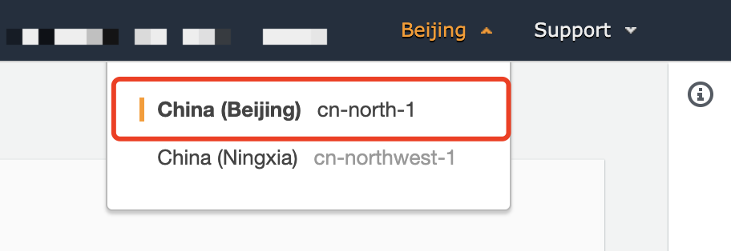
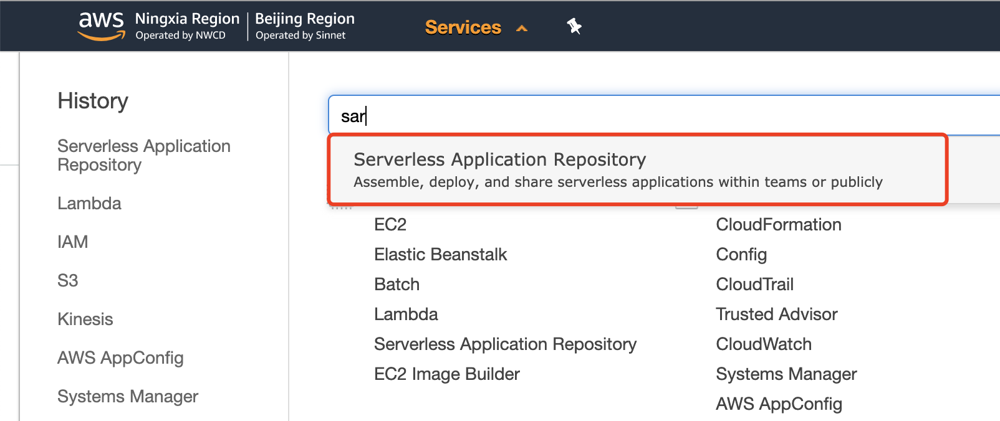
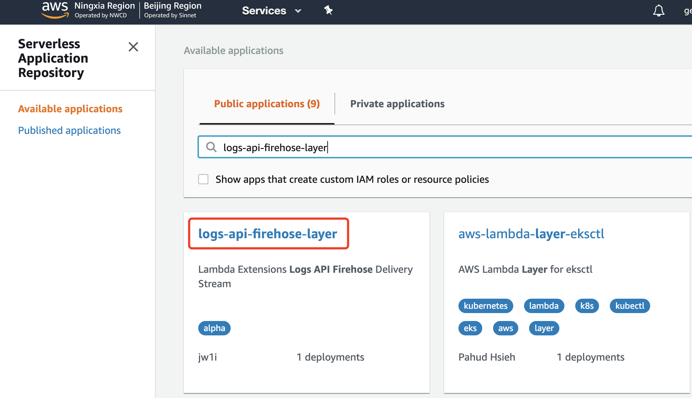
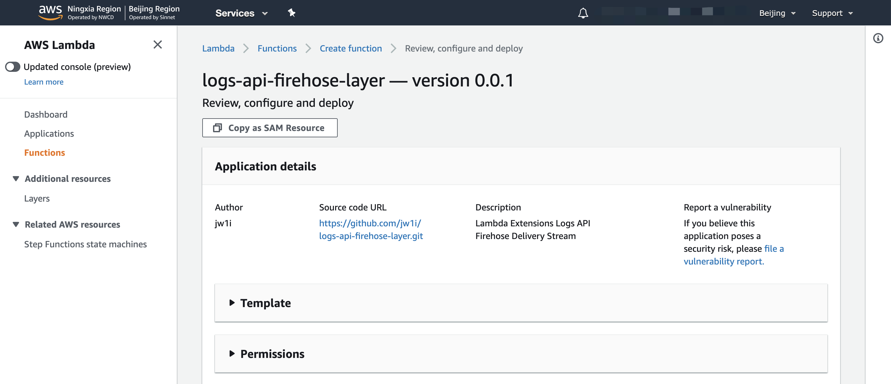
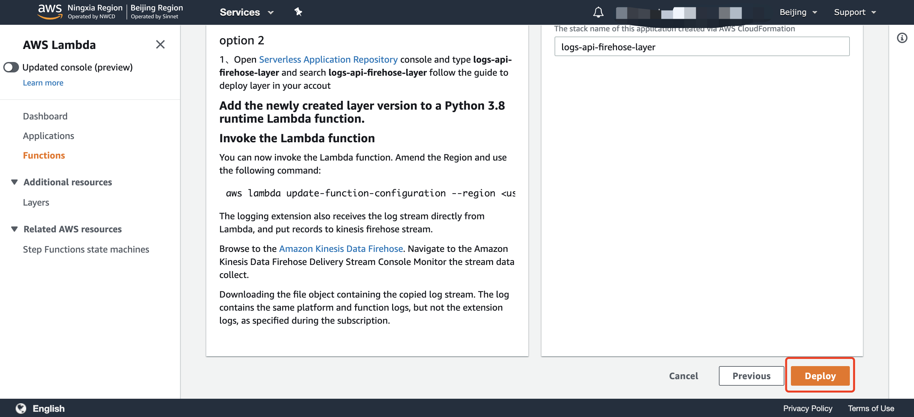
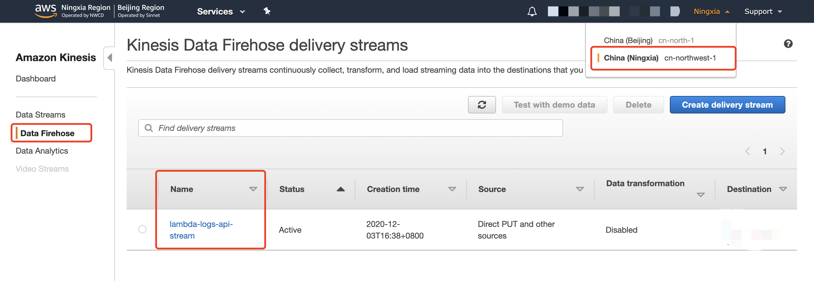
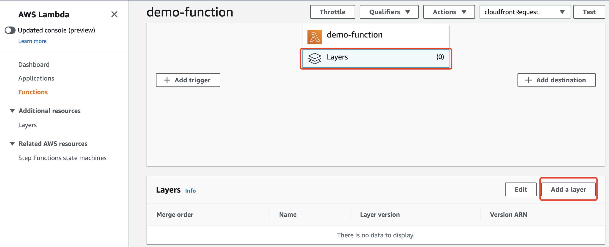
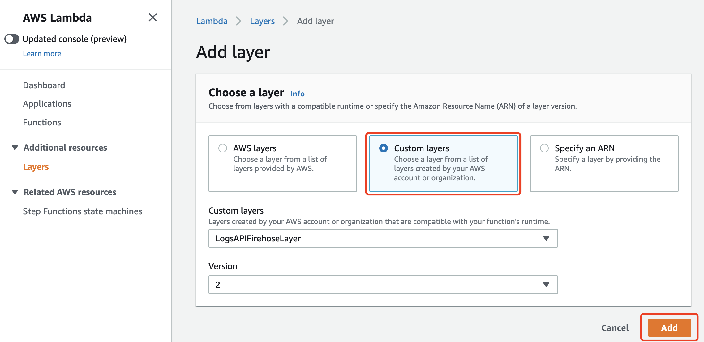
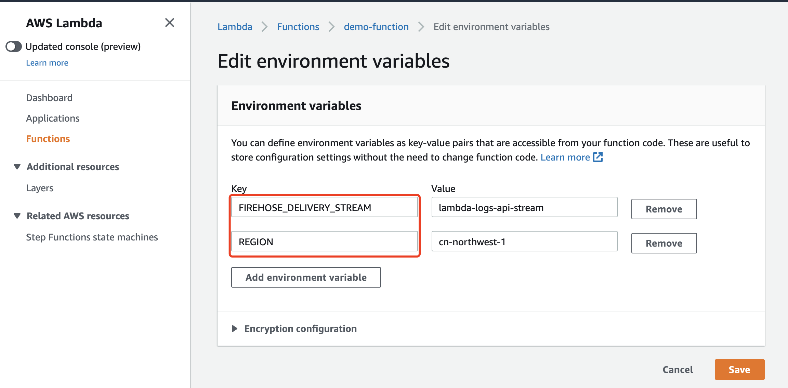
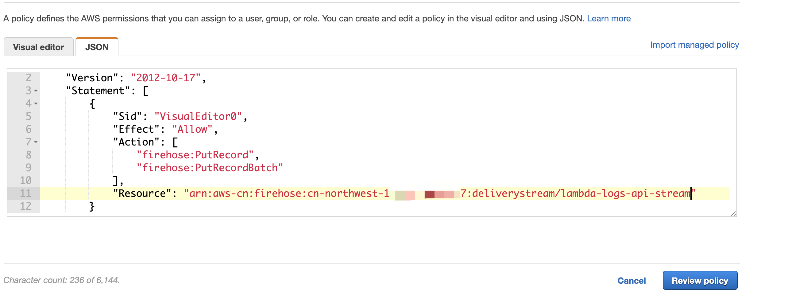

# Logs API Firehose Layer

这是一个可以在AWS中国区账号下使用的lambda层，该层实现了订阅Lambda Logs API 并发送到Kinesis Firehose Delivery Stream

可以通过AWS控制台中 Serverless application repository 进行部署，

### 步骤如下：

1、使用IAM用户 [登录AWS账号](https://console.amazonaws.cn/?nc2=h_m_mc)

2、选择北京区域

3、在控制台左侧点击Service，在弹出的搜索框中输入 **sar**，点击出现的 **Serverless Application Repository** 进入该服务的控制台。

4、在 Serverless application repository 控制台中输入 **logs-api-firehose-layer** 点击出现的Lambda层的依赖

5、点击标题会跳转到lambda层部署的界面，滑动到最下方点击部署，等待lambda层部署完毕，并记录ARN

6、在北京或宁夏区域创建Kinesis Delivery Stream 并配置 stream 的目的地, 并记录 name 和 region

7、为lambda函数添加层，并选择刚刚创建的层以及对应的版本号，同时为lambda添加两个环境变量，覆盖默认值：
	
	步骤6中创建的stream名称
	FIREHOSE_DELIVERY_STREAM	
	
	步骤6中创建的stream 所在的区域
	REGION
	
	如果没有创建环境变量 lambda层默认写入当前账号 cn-northwest-1 区域 名为 lambda-logs-api-stream 的 Kinesis Delivery Stream ， 如果账号中未创建对应的stream 也未配置环境变量会导致lambda 插件报错退出。
	

8、 为lambda添加写入Kinesis Delivery Stream的权限，替换JSON中Resource的值为账号中Kinesis Delivery Stream 的 ARN ，并将JSON添加到Lambda的执行权限中。JSON如下：

	{
	    "Sid": "VisualEditor0",
	    "Effect": "Allow",
	    "Action": [
	        "firehose:PutRecord",
	        "firehose:PutRecordBatch"
	    ],
	    "Resource": "arn:aws:firehose:REGION:ACCOUNT_ID:deliverystream/STREAM_NAME"
	}

Lambda执行角色iam policy类似下方：

9、完成配置后便可以将lambda 运行的日志输出到firehose delivery stream 进而将日志输出到s3或者elastic search